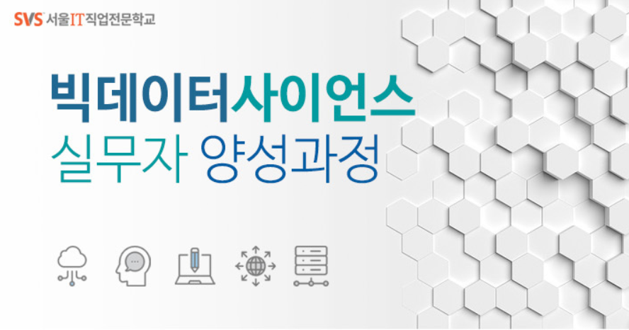

# 빅데이터 사이언스 실무자 양성과정
* BigData Science Practical Training Course

    파이썬@ 
       <a href='https://www.facebook.com/dongjo.lim.7'>LDJ</a>
    , [임동조](frontierlim13@gmail.com)

<h2><b>SBA 빅데이터 사이언스 실무자</b></h2>

## Notice for Team Project

00_파이썬실전프로그래밍
01_파이썬활용빅데이터수집&처리
02_머신러닝_딥러닝I
03_머신러닝_딥러닝II

## Reference Documents

- Proj-01. [00_파이썬실전프로그래밍_필답형자료 ][proj-01]
- Proj-02. [01_파이썬활용빅데이터수집&처리_필답형자료  ][proj-02]
- Proj-03. [02_머신러닝_딥러닝I_ 필답형자료  ][proj-03]
- Proj-04. [03_R기본및통계기본  ][proj-04]
- Proj-05. [04_머신러닝_딥러닝II_필답형자료  ][proj-05]

[proj-01]:  ./docu/Python_Basic_v10_0926_Problem.pdf       "Go proj-01"
[proj-02]:  ./docu/..    "Go proj-02"
[proj-03]:  ./docu/..    "Go proj-03"
[proj-04]:  ./docu/..    "Go proj-04"
[proj-05]:  ./docu/MLDLII_Problem_v10_1008.pdf    "Go proj-05"

### SBA19 빅데이터 실무자 양성과정 1기 !!  최고 멋진 친구들 버전 화이팅!!! ver3 ^^

 &lt; The End &gt; 

