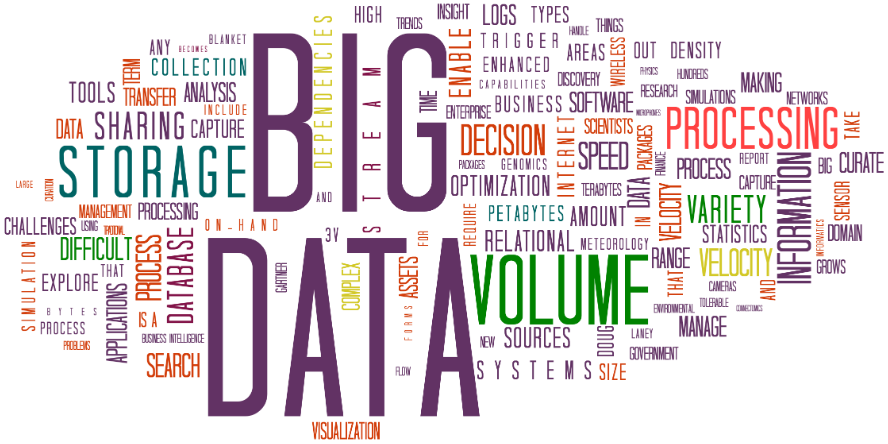
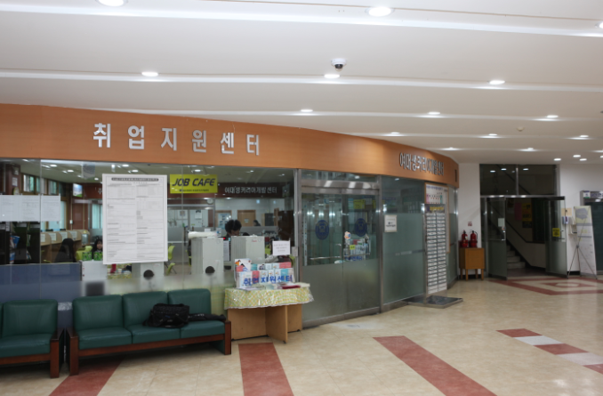

# 빅데이터 사이언스 실무자 양성과정
* BigData Science Practical Training Course

    파이썬@ 
       <a href='https://www.facebook.com/dongjo.lim.7'>LDJ</a>
    , [임동조](frontierlim13@gmail.com)

<h2><b>SBA 빅데이터 사이언스 실무자</b></h2>

## Notice for Team Project

일일 프로젝트 진행
2019.10.15(화) ~ 2019.10.22(화)  
STEP 01. 과제 선정  
STEP 02. 데이터 수집 및 처리/시각화  
STEP 03. CNN 딥러닝 모델 만들기 및 성능 고도화  
STEP 04. 2019.10.21 23:00 결과물 제출   

팀별 발표    
2019.10.22(화) 
 

## Reference Documents

# 문서초안-세부 사항은 변경될 수 있음.
- Proj-01. [포트폴리오 자료           ][proj-01]
- Proj-02. [프로젝트보고서 포맷           ][proj-02]

[proj-01]:  ./docu/Kaggle_Portfolio_v10_1015.pdf     "Go proj-01"
[proj-02]:  ./docu/SBA19_프로젝트보고서_포맷_OOO팀.docx           "Go proj-02"

##  Team Project : Kick Off

- <b>1st Subject </b>: <b>Analyze Social Issues Using BigData </b>
- <b>Our Motto   </b>: <b>Learning by doing, doing by learning !! </b>
- <b>Report Format </b>: <a href="./docu/SBA19_프로젝트보고서_포맷_OOO팀.docx">착수보고서 양식</a>
- ※ If you click on the image on the right, you can view "Initiation Report" by team.

<table border=1 bgcolor="#EEEEEE">
	<tr bgcolor="#CC0000">
		<td width="100">
<b>Team Name        </b>
</td>
		<td width="100">
<b>Team Building    </b>
</td>
		<td width="300">
<b>Project Subject  </b>
</td>
		<td width="120">
<b>Reports          </b>
</td>
	</tr>
	<tr>
		<td>
        
 
            A팀  
            <b>Team Name1</b>                                                                                                   
</td>
		<td>
            
 
                 홍길동, TOTO  이기자, 굿프렌즈                                                             

        </td>
		<td>
 취업 지역 불평등 문제 해결하기 
</td>
		<td>
            
     
            

        </td>
	</tr>
	<tr>
		<td>
        
 
            B팀  
            <b>Team Name2</b>                                                                                                   
</td>
		<td>
            
 
                 홍길동, TOTO  이기자, 굿프렌즈                                                             

        </td>
		<td>
 빅데이터 의료 평등화 해결하기 
</td>
		<td>
            
     
            

        </td>
	</tr>
	<tr>
		<td>
        
 
            C팀  
            <b>Team Name3</b>                                                                                                   
</td>
		<td>
            
 
                 홍길동3, TOTO  이기자2, 굿프렌즈3                                                             

        </td>
		<td>
 마케팅 빅데이터 활용 
</td>
		<td>
            
     
            

        </td>
	</tr>

 
### SBA19 빅데이터 실무자 양성과정 1기 !!  최고 멋진 친구들 버전 화이팅!!! ver3 ^^

##  Team Project : Final Report
- <b>Submission   </b>: 착수보고, 결과보고, 소스코드
- <b>Presentation </b>: 10min / team, Q&A
- <b>Keep in mind </b>: <b> Share Lessons Learned !! </b>

### Project Team A 

<table border=1 width=100%>
	<tr>
		<td width="25%">
<b>Project Team</b>
</td>
		<td width="75%">
 팀명 
</td>
	</tr>
	<tr>
		<td>
<b>Team Members</b>
</td>
		<td>
 홍길동3, TOTO, 이기자2, 굿프렌즈 
</td>
	</tr>
	<tr>
		<td>
<b>Report</b>
</td>
		<td>
			
 
				<a href="reports/SBA19_S1_착수보고서_A팀.pdf">[A팀 착수보고]</a>, &nbsp;&nbsp;&nbsp; 
				<a href="reports/Team_A/code/">[A팀 소스코드]</a>  
			

		</td>
	</tr>
	<tr>
		<td>
<b>Subject</b>
</td>
		<td>
 의료 빅데이터를 활용 방안 모색
</td>
	</tr>
	<tr>
		<td>
<b>Presentation</b>
</td>
		<td>

</td>
	</tr>
</table>

 &lt; The End &gt; 

